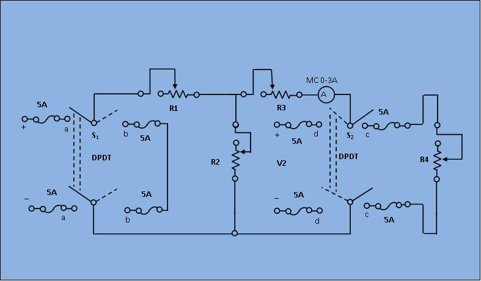

### Procedure

                            
                            

								 <figure style="text-align:center">
									  
									  <figcaption>[Fig 1: Circuit diagram for Experimental set up]</figcaption>
								</figure> 
								

								<ol type="1">
                                <li>Keep all the resistance close to their maximum respective values.</li>
								<li>Close the switch s1 to "aa" and s2 to "cc" positions. Observes the load current IL and voltage (\(V_L\)) readings. The load resistance,
										\begin{align}
										R_{L} & = \frac{V_{L}}{I_{L}} 
										\end{align} 
									</li> 
									<li>Short the load terminals and find the short circuited current(\(I_{sc}\)).</li>
									<li>Next, compute the resistance (\(R_{int}\)) of the network as seen from the load terminals, 
									<ul>
										<li>Replace the 220 V source by a short by closing \(s_1\) to "bb".</li>
										<li>Apply V=110 V at the output terminals by closing \(s_2\) to "dd". Read the current from ammeter (I) and get
										\begin{align}
										R_{int} & = \frac{V}{I} 
										\end{align}</li>
									</ul></li>
									<li>Now compute the load current (\(I_L\)) applying Norton theorem.
									\begin{align}
									I_L & = I_{sc}*\frac{R_{int}}{(R_{int}+R_L)} 
									\end{align}
									</li>
									<li>Compare the above computed load current with its observed value in step (2) and verify the theorem.</li>
								</ol>   
							
                                
                        
